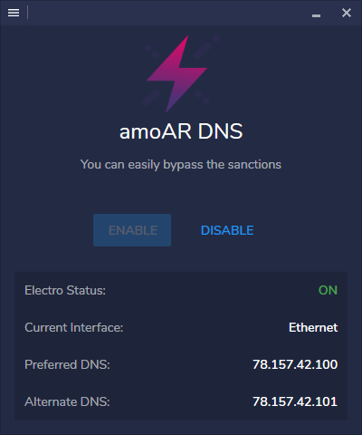

# Electro Desktop (Unofficial)

Simple Windows application for Electro service (See [Electrotm.org](https://electrotm.org) for more information).
If you refuse to enter Electro dns manually, you can use this program.

This software includes the ShecanDesktop Library: Copyright (C) 2019 AmRo045

## Third-Party

- Fody.4.2.1
- PropertyChanged.Fody.2.6.1
- MaterialDesignThemes.2.5.1
- MaterialDesignColors.1.1.3
- MahApps.Metro.1.6.0
- ControlzEx.3.0.2.4
- Newtonsoft.Json.12.0.2

## Screenshot

